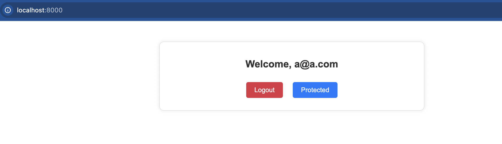
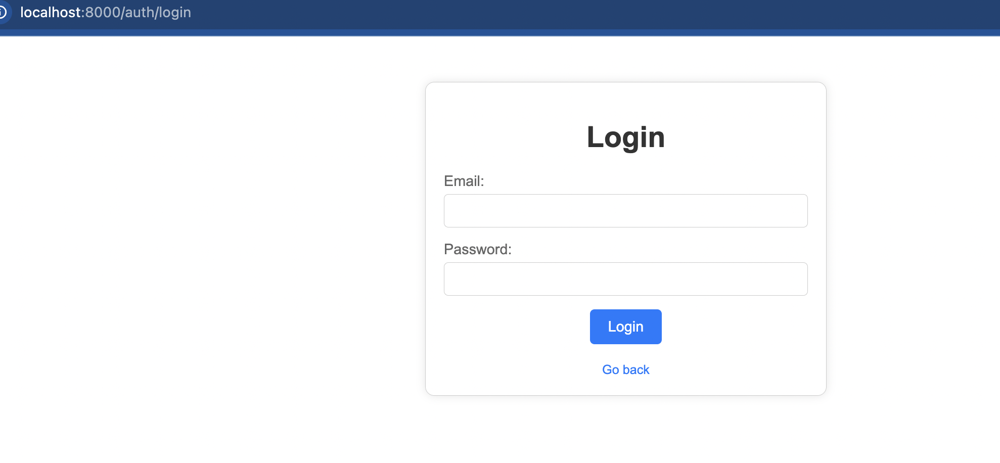
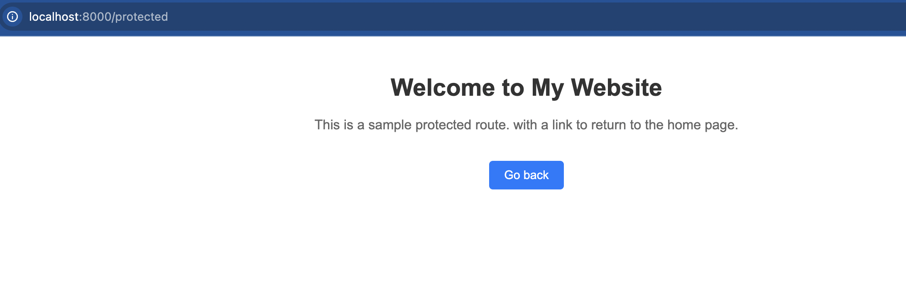
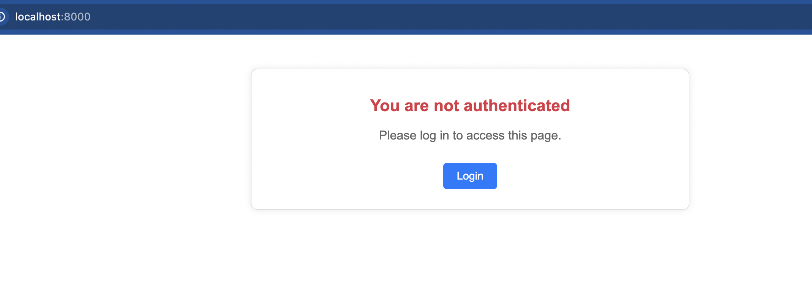

# TypeScript Express Decorators Example

This is a simple application to demonstrate the use of TypeScript with Express, highlighting how decorators and ReflectMetadata can be used to attach various behaviors to routes.

## Project Description

This project showcases a basic Express application written in TypeScript. It aims to prove the effectiveness and convenience of using decorators to manage route behaviors, middleware, and metadata in an Express application. By leveraging TypeScript's type safety and ReflectMetadata, we can create more maintainable and scalable applications.

## Features

- **TypeScript Integration:** Strongly typed code with TypeScript.
- **Express Framework:** Robust and minimalist web framework for Node.js.
- **Decorators:** Simplified route definitions and middleware attachment.
- **ReflectMetadata:** Metadata management for enhanced functionality.

## Getting Started

### Prerequisites

Ensure you have the following installed:

- Node.js (>= 12.x)
- pnpm

### Installation

1. Clone the repository:
    ```bash
    git clone https://github.com/AlexanderHMagno/express-ts
    cd your-repo-name
    ```

2. Install dependencies:
    ```bash
    pnpm install
    # or
    yarn install
    ```

### Running the Application

To start the application in development mode:

```bash
pnpm start
# or
yarn dev
```

The server will be running on `http://localhost:8000`.

To Access the aplication only a harcoded email will work

```
Email : a@a.com
Password: 1234
```

## Project Structure

```
├── src
│   ├── controllers
│   │   └── exampleController.ts
│   ├── middlewares
│   │   └── exampleMiddleware.ts
│   ├── routes
│   │   └── index.ts
│   ├── decorators
│   │   └── routeDecorators.ts
│   ├── app.ts
│   └── server.ts
├── .gitignore
├── package.json
├── tsconfig.json
└── README.md
```

## Usage

### Creating Routes with Decorators

Define your routes using custom decorators in the `controllers` directory. Below is an example of a controller with decorated routes:

```typescript
import { Request, Response } from 'express';
import { Controller, Get, Post } from './decorators/routeDecorators';

@Controller('/example')
class ExampleController {
  @Get('/')
  getExample(req: Request, res: Response) {
    res.send('GET request to the example route');
  }

  @Post('/')
  postExample(req: Request, res: Response) {
    res.send('POST request to the example route');
  }
}
```

### Middleware

You can also attach middleware to routes using decorators:

```typescript
import { Request, Response, NextFunction } from 'express';

export function ExampleMiddleware(req: Request, res: Response, next: NextFunction) {
  console.log('Example middleware executed');
  next();
}
```

Apply the middleware in your route:

```typescript
import { Controller, Get, Use } from './decorators/routeDecorators';
import { ExampleMiddleware } from './middlewares/exampleMiddleware';

@Controller('/example')
class ExampleController {
  @Get('/')
  @Use(ExampleMiddleware)
  getExample(req: Request, res: Response) {
    res.send('GET request to the example route');
  }
}
```


## Application Views






## License

This project is licensed under the MIT License. See the [LICENSE](LICENSE) file for details.


